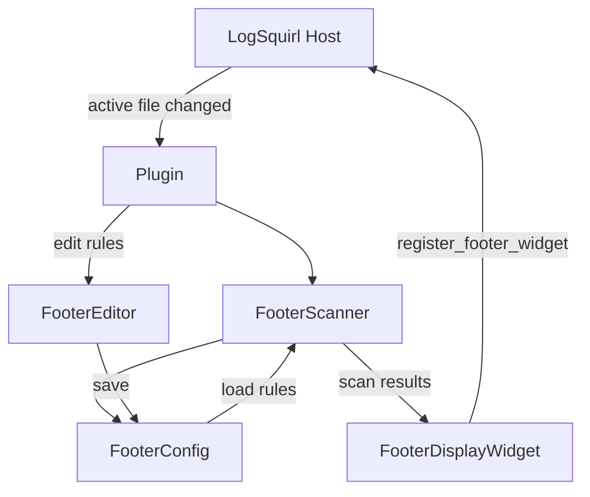
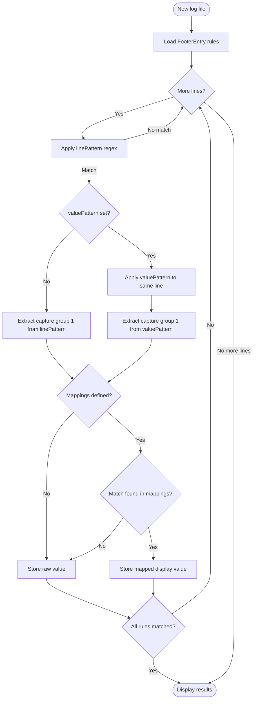

# logsquirl-custom-footer — Custom Footer Plugin for LogSquirl

[](https://github.com/64x-lunicorn/LogSquirl-CustomFooter/actions/workflows/ci-build.yml)
[](LICENSE)
[](https://github.com/64x-lunicorn/LogSquirl-CustomFooter/releases)
[](https://github.com/64x-lunicorn/LogSquirl-CustomFooter/commits/main)
[]()

A [LogSquirl](https://github.com/64x-lunicorn/LogSquirl) plugin that extracts key-value pairs
from log files using configurable regex rules and displays them in a footer bar.

## Features

- **Regex-based extraction** — define rules that match log lines and capture values
- **Two-stage matching** — optional second regex applied to the matched line for fine-grained
  value extraction
- **Value mapping** — translate raw extracted values to human-readable display text
- **JSON import / export** — share rule sets between users or projects
- **Footer bar display** — results shown in a compact bar at the bottom of the main window
- **Cross-platform** — works on macOS, Linux, and Windows

## Prerequisites

- **LogSquirl** ≥ 26.03 with the plugin system enabled
- **Qt6** (Core + Widgets) — same version LogSquirl was built with
- **CMake** ≥ 3.16
- A C++17-capable compiler (GCC ≥ 9, Clang ≥ 14, MSVC ≥ 19.29)

## Architecture



## Rule Evaluation Flow



## Configuration

Rules are persisted in `custom_footer.ini` inside the plugin's config directory.

### INI Format (internal)

```ini
[entries]
1\key=VIN
1\linePattern=VIN:\\s+(\\S+)
1\valuePattern=
1\enabled=true
1\mappings\size=0

2\key=Component Protection
2\linePattern=isComponentProtectionEnabled
2\valuePattern=:\\s+(\\S+)$
2\enabled=true
2\mappings\1\pattern=true
2\mappings\1\display=Enabled
2\mappings\2\pattern=false
2\mappings\2\display=Disabled
2\mappings\size=2
```

### JSON Format (import / export)

```json
{
  "version": 1,
  "entries": [
    {
      "key": "VIN",
      "linePattern": "VIN:\\s+(\\S+)",
      "valuePattern": "",
      "enabled": true,
      "mappings": []
    },
    {
      "key": "Component Protection",
      "linePattern": "isComponentProtectionEnabled",
      "valuePattern": ":\\s+(\\S+)$",
      "enabled": true,
      "mappings": [
        { "pattern": "true",  "display": "Enabled" },
        { "pattern": "false", "display": "Disabled" }
      ]
    }
  ]
}
```

## Build

```bash
# Clone
git clone https://github.com/64x-lunicorn/LogSquirl-CustomFooter.git
cd LogSquirl-CustomFooter

# Configure
cmake -B build -S . -DCMAKE_BUILD_TYPE=Release

# If Qt6 is not in PATH (e.g. Homebrew on macOS):
cmake -B build -S . -DCMAKE_BUILD_TYPE=Release \
  -DCMAKE_PREFIX_PATH="$(brew --prefix qt6)"

# Build
cmake --build build --parallel

# The shared library is in build/:
#   macOS:   build/liblogsquirl_custom_footer.dylib
#   Linux:   build/liblogsquirl_custom_footer.so
#   Windows: build/logsquirl_custom_footer.dll
```

### Running Tests

```bash
cmake -B build -S . -DCMAKE_BUILD_TYPE=Release -DBUILD_TESTS=ON
cmake --build build --parallel
cd build && ctest --output-on-failure
```

## Install

Copy the plugin library **and** `plugin.json` into one of LogSquirl's
plugin search directories:

| Platform | Plugin Directory |
|----------|-----------------|
| macOS    | `~/Library/Application Support/logsquirl/plugins/io.github.logsquirl.custom-footer/` |
| Linux    | `~/.local/share/logsquirl/plugins/io.github.logsquirl.custom-footer/` |
| Windows  | `%APPDATA%/logsquirl/plugins/io.github.logsquirl.custom-footer/` |

```bash
# Example for macOS:
DEST="$HOME/Library/Application Support/logsquirl/plugins/io.github.logsquirl.custom-footer"
mkdir -p "$DEST"
cp build/liblogsquirl_custom_footer.dylib "$DEST/"
cp plugin.json "$DEST/"
```

## License

GPL-3.0-or-later — see [LICENSE](LICENSE) for the full license text.

The vendored `include/logsquirl_plugin_api.h` header is MIT-licensed, so
plugins of any license can build against the LogSquirl Plugin SDK without
taking on GPL obligations. See [NOTICE](NOTICE) for details.
