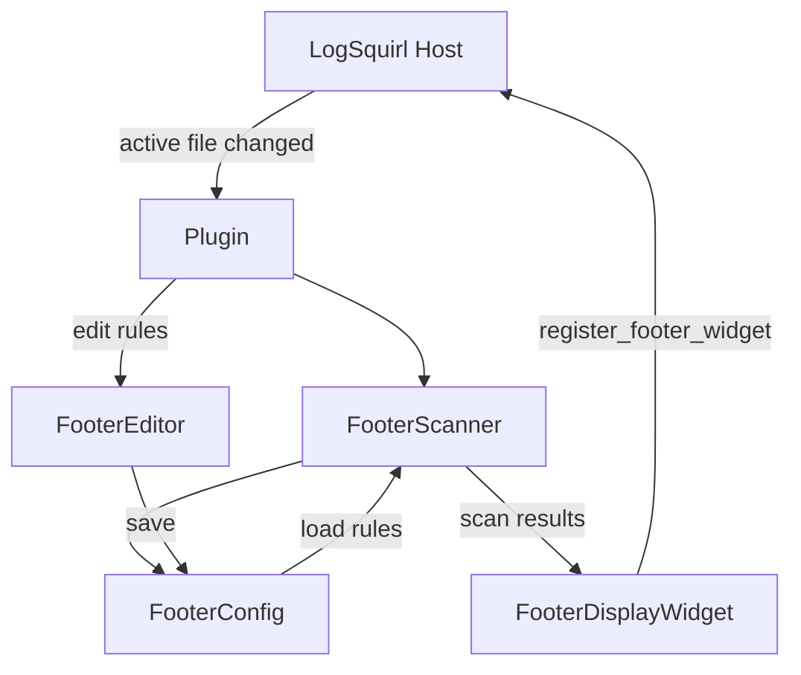

<!-- Allow GitHub's presentation markup and a logo before the main heading. -->
<!-- markdownlint-configure-file {"MD033": {"allowed_elements": ["div", "img"]}, "MD041": false} -->

<div align="center">


# Custom Footer

**The values you care about, always in view.**

**A [LogSquirl](https://github.com/64x-lunicorn/LogSquirl) plugin that lifts
key-value pairs out of a log and pins them to a footer bar.**

Write a regex rule once — build number, VIN, session id, firmware version — and
it stays on screen while you scroll through everything else.

[](https://github.com/64x-lunicorn/LogSquirl-CustomFooter/actions/workflows/ci-build.yml)
[](https://github.com/64x-lunicorn/LogSquirl-CustomFooter/releases/latest)
[](https://github.com/64x-lunicorn/LogSquirl-CustomFooter/releases)
[](#install)
[](LICENSE)

[Install](#install) &nbsp;/&nbsp;
[Configuration](#configuration) &nbsp;/&nbsp;
[Build](#build) &nbsp;/&nbsp;
[Architecture](#architecture) &nbsp;/&nbsp;
[Changelog](CHANGELOG.md)

</div>

---

## Why this plugin?

Some facts about a log are true for the whole file, not for one line: which
build produced it, which vehicle, which session. Searching for them again every
time you scroll is wasted motion. This plugin extracts them once and keeps them
in the footer.

| Write the rule | Read the answer |
| :--- | :--- |
| **Regex extraction.** A rule matches a line and captures the value you want from it. | **Always on screen.** Results sit in a compact bar along the bottom of the main window. |
| **Two-stage matching.** An optional second regex runs against the matched line, for when the value needs a finer cut than the line pattern gives. | **Readable values.** Map raw captures to display text, so `0x04` can read as `Production`. |
| **Rules you can share.** Import and export rule sets as JSON, per project or per team. | **Edited in place.** Rules are managed in a dialog, with an inline editor for the value mappings. |

## Install

### From LogSquirl

*Plugins → Browse Plugins…* → **Custom Footer** → **Install**. The archive is
downloaded, verified against its SHA-256 checksum and loaded — no file copying.

### From a release

Download the archive for your platform from the
[releases page](https://github.com/64x-lunicorn/LogSquirl-CustomFooter/releases/latest)
and unpack it into LogSquirl's plugin directory:

| Platform | Plugin Directory |
|----------|-----------------|
| macOS    | `~/Library/Application Support/logsquirl/plugins/io.github.logsquirl.customfooter/` |
| Linux    | `~/.local/share/logsquirl/plugins/io.github.logsquirl.customfooter/` |
| Windows  | `%APPDATA%/logsquirl/plugins/io.github.logsquirl.customfooter/` |

### From source

See [Build](#build), then:

```bash
DEST="$HOME/Library/Application Support/logsquirl/plugins/io.github.logsquirl.customfooter"
mkdir -p "$DEST"
cp build/liblogsquirl_custom_footer.dylib "$DEST/"
cp plugin.json icon.png "$DEST/"
```

After installing, restart LogSquirl or re-scan via *Plugins → Manage Plugins…*.

## Configuration

Rules are persisted in `custom_footer.ini` inside the plugin's config directory.

### INI Format (internal)

```ini
[entries]
1\key=VIN
1\linePattern=VIN:\\s+(\\S+)
1\valuePattern=
1\enabled=true
1\mappings\size=0

2\key=Component Protection
2\linePattern=isComponentProtectionEnabled
2\valuePattern=:\\s+(\\S+)$
2\enabled=true
2\mappings\1\pattern=true
2\mappings\1\display=Enabled
2\mappings\2\pattern=false
2\mappings\2\display=Disabled
2\mappings\size=2
```

### JSON Format (import / export)

```json
{
  "version": 1,
  "entries": [
    {
      "key": "VIN",
      "linePattern": "VIN:\\s+(\\S+)",
      "valuePattern": "",
      "enabled": true,
      "mappings": []
    },
    {
      "key": "Component Protection",
      "linePattern": "isComponentProtectionEnabled",
      "valuePattern": ":\\s+(\\S+)$",
      "enabled": true,
      "mappings": [
        { "pattern": "true",  "display": "Enabled" },
        { "pattern": "false", "display": "Disabled" }
      ]
    }
  ]
}
```

## Prerequisites

- **LogSquirl** ≥ 26.03 with the plugin system enabled
- **Qt6** (Core + Widgets) — same version LogSquirl was built with
- **CMake** ≥ 3.16
- A C++17-capable compiler (GCC ≥ 9, Clang ≥ 14, MSVC ≥ 19.29)

## Build

```bash
# Clone
git clone https://github.com/64x-lunicorn/LogSquirl-CustomFooter.git
cd LogSquirl-CustomFooter

# Configure
cmake -B build -S . -DCMAKE_BUILD_TYPE=Release

# If Qt6 is not in PATH (e.g. Homebrew on macOS):
cmake -B build -S . -DCMAKE_BUILD_TYPE=Release \
  -DCMAKE_PREFIX_PATH="$(brew --prefix qt6)"

# Build
cmake --build build --parallel

# The shared library is in build/:
#   macOS:   build/liblogsquirl_custom_footer.dylib
#   Linux:   build/liblogsquirl_custom_footer.so
#   Windows: build/logsquirl_custom_footer.dll
```

### Running Tests

```bash
cmake -B build -S . -DCMAKE_BUILD_TYPE=Release -DBUILD_TESTS=ON
cmake --build build --parallel
cd build && ctest --output-on-failure
```

## Architecture



## Rule Evaluation Flow


## License

GPL-3.0-or-later — see [LICENSE](LICENSE) for the full license text.

The vendored `include/logsquirl_plugin_api.h` header is MIT-licensed, so
plugins of any license can build against the LogSquirl Plugin SDK without
taking on GPL obligations. See [NOTICE](NOTICE) for details.
