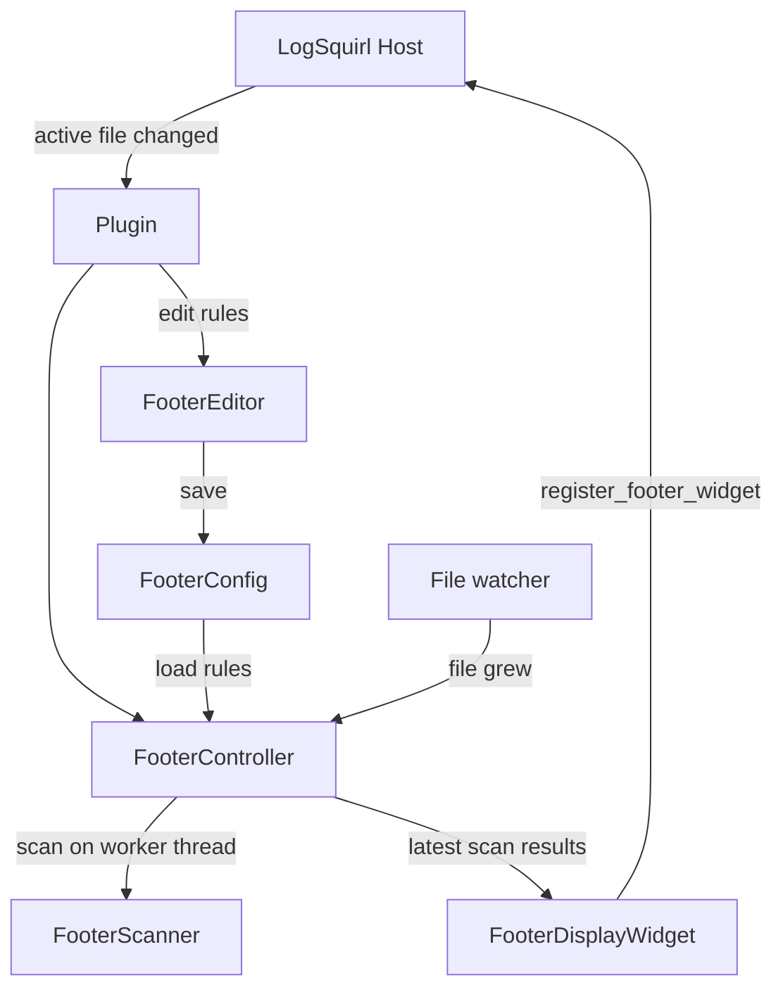
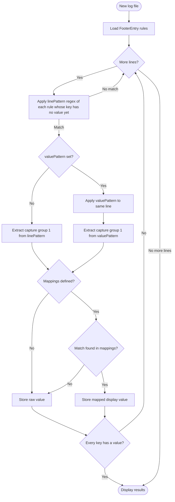

<!-- Allow GitHub's presentation markup and a logo before the main heading. -->
<!-- markdownlint-configure-file {"MD033": {"allowed_elements": ["div", "img"]}, "MD041": false} -->

<div align="center">


# Custom Footer

**The values you care about, always in view.**

**A [LogSquirl](https://github.com/64x-lunicorn/LogSquirl) plugin that lifts
key-value pairs out of a log and pins them to a footer bar.**

Write a regex rule once — build number, VIN, session id, firmware version — and
it stays on screen while you scroll through everything else.

[](https://github.com/64x-lunicorn/LogSquirl-CustomFooter/actions/workflows/ci-build.yml)
[](https://github.com/64x-lunicorn/LogSquirl-CustomFooter/releases/latest)
[](https://github.com/64x-lunicorn/LogSquirl-CustomFooter/releases)
[](#install)
[](LICENSE)

[Install](#install) &nbsp;/&nbsp;
[Configuration](#configuration) &nbsp;/&nbsp;
[Build](#build) &nbsp;/&nbsp;
[Architecture](#architecture) &nbsp;/&nbsp;
[Changelog](CHANGELOG.md)

</div>

---

## Why this plugin?

Some facts about a log are true for the whole file, not for one line: which
build produced it, which vehicle, which session. Searching for them again every
time you scroll is wasted motion. This plugin extracts them once and keeps them
in the footer.

| Write the rule | Read the answer |
| :--- | :--- |
| **Regex extraction.** A rule matches a line and captures the value you want from it. | **Always on screen.** Results sit in a compact bar along the bottom of the main window; a click copies a value. |
| **Two-stage matching.** An optional second regex runs against the matched line, for when the value needs a finer cut than the line pattern gives. | **Readable values.** Map raw captures to display text, so `0x04` can read as `Production`. |
| **Rules you can share.** Import and export rule sets as JSON, per project or per team. | **Edited in one place.** Rules are managed in a dialog: a list of all rules, and a panel with the patterns and value mappings of the selected one. |

## Install

### From LogSquirl

*Plugins → Browse Plugins…* → **Custom Footer** → **Install**. The archive is
downloaded, verified against its SHA-256 checksum and loaded — no file copying.

### From a release

Download the archive for your platform from the
[releases page](https://github.com/64x-lunicorn/LogSquirl-CustomFooter/releases/latest)
and unpack it into LogSquirl's plugin directory:

| Platform | Plugin Directory |
|----------|-----------------|
| macOS    | `~/Library/Application Support/logsquirl/plugins/io.github.logsquirl.customfooter/` |
| Linux    | `~/.local/share/logsquirl/plugins/io.github.logsquirl.customfooter/` |
| Windows  | `%APPDATA%/logsquirl/plugins/io.github.logsquirl.customfooter/` |

### From source

See [Build](#build), then:

```bash
DEST="$HOME/Library/Application Support/logsquirl/plugins/io.github.logsquirl.customfooter"
mkdir -p "$DEST"
cp build/liblogsquirl_custom_footer.dylib "$DEST/"
cp plugin.json icon.png "$DEST/"
```

After installing, restart LogSquirl or re-scan via *Plugins → Manage Plugins…*.

## Configuration

Rules are edited in *Plugins → Custom Footer…*. The dialog lists the rules on
the left, each with its enabled check box, key and line pattern, with buttons
to add (also from a template), remove, reorder, import and export them. The panel on the right shows
the selected rule: its key, line pattern, value pattern and value mappings.
Changes show up in the list as you type.

Order matters: among rules sharing a key, the one higher in the list wins on
the same line. Reorder rules by dragging them in the list, with the ↑/↓
buttons, or with Ctrl+Shift+Up / Ctrl+Shift+Down (⇧⌘↑ / ⇧⌘↓ on macOS) while
the list has the focus. A rule keeps its mappings, enabled state and
validation marks wherever it is moved, and stays selected.

Rules are persisted in `custom_footer.ini` inside the plugin's config directory.

### Simple and advanced mode

Most rules need no regex. In **simple mode** a rule is described by:

- the **text before the value**, e.g. `VIN:`, matched literally — `[`, `.`,
  `(` or `\` are just characters — with any whitespace after it ignored;
- where the **value ends**: at whitespace (one word, the default), at the
  end of the line (without trailing whitespace), or before a given
  character, e.g. `,` or `;` (without the whitespace before it). The
  character may be any single character, emoji included, but not a control
  character such as a tab; until it is entered, the rule is marked and the
  rules cannot be saved.

Whitespace means ASCII whitespace, such as spaces and tabs, as `\s` in the
patterns: a no-break space or an ideographic space is part of the value.

The line pattern is generated from these and shown read-only; a simple rule
needs no value pattern. `VIN:` with the value ending at whitespace becomes
`VIN:\s*(\S+)`: only regex metacharacters are escaped. New rules start in
simple mode, and a hand-written rule like `VIN:\s*(\S+)` opens in it.

Check **Advanced** to edit the line and value patterns directly; the
generated patterns are kept. Switching back is offered only while the
patterns still have exactly the form simple mode generates. When the editor
opens, a rule whose patterns have that form is shown in simple mode, every
other rule in advanced mode. Simple rules are saved as their patterns, so the
config and JSON formats do not change.

### Rule templates

**From template…** next to the add button adds a ready-made rule to adjust
instead of writing one. The new rule goes after the others and is selected;
no existing rule changes.

| Template | Key | Finds | Mode |
|----------|-----|-------|------|
| Version | `Version` | The number after `version` or `ver` in any case, also after `_` or in camel case (`app_version=1.2.3`, `appVersion: 2.1.0`), with optional quotes, `:`, `=`, `>` or `.` and `v` between (`Version: v2.0.1-rc1` → `2.0.1-rc1`, `{"version": "1.2.3"}`, `<version>1.2.3`, `Ver. 2.1`), or after a `v` starting a word when it has a dot (`v1.2.3`). A suffix like `-rc1`, `-beta.2` or `+build.5` is part of it; a date is not. The `version` of an XML declaration (`<?xml version="1.0"`) is skipped. | Advanced |
| Build number | `Build` | The word after `Build:` (`Build: 1234`) | Simple |
| Serial number | `Serial number` | The word after `Serial number:` | Simple |
| IPv4 address | `IP address` | The first address in a line, four numbers 0–255 without leading zeros, not part of a word or a longer dotted sequence (`v1.2.3.4`, `1.2.3.4.5`) | Advanced |
| Timestamp (ISO 8601) | `Timestamp` | The first date and time in a line: `2024-01-15T10:30:00Z`, with `T` or a space, optional seconds, fraction and `Z` or an offset of `±HH`, `±HHMM` or `±HH:MM`, `t` and `z` in lower case too. Truncated fields such as `10:30:5` or `+01:0` are not matched; a `:` after a complete timestamp (`10:30:00: started`) is fine. | Advanced |
| `key=value` | the key you give | The value right after `<key>=`, up to the next whitespace, as in logfmt. Also as a flag, `-user=` or `--user=`. Not in a longer key (`superuser=`, `a.user=`, `my-user=`), and `user= x` has no value. | Advanced |

Simple templates match their text as written, case included, so change
`Build:` to what your log says. Version does not count `version` inside
another word (`conversion`, `server`), and so also misses a lower-case
`appversion`; `app_version` and `appVersion` are found. For `key=value`,
give the key without `=` (a trailing `=` is dropped); for lists separated
by `;` or `,`, change `(\S+)` in the pattern to `([^;]+)`. If an enabled
rule with a line pattern already has the template's key, the dialog says
so: the new rule becomes an alternative for that key.

### How rules are applied

- Each key takes its value from the **first line** of the file that one of
  its rules matches. Rules may share a key as **alternatives**, e.g. one
  pattern for old logs and one for new ones: whichever matches first in the
  file provides the value, and if several match the same line, the one
  higher in the list wins. The key is shown once, where its first rule is.
- A rule without a line pattern is ignored. The editor marks invalid
  patterns, and enabled rules with a line pattern but no key, at the field
  with the reason and in the rule list, and won't save until they are fixed.
- The file is scanned in the background whenever it becomes the active file
  and when rules are applied. A rule with an invalid pattern is skipped and
  reported in the LogSquirl log.
- The active file is **watched**: when it changes, e.g. while following a
  growing log, it is scanned again within about half a second, so values
  that show up later in the file appear in the footer. Only the lines
  appended since the last scan are read, and none once every key has a
  value; a file that was truncated or replaced is scanned from its start.
  If the file is rotated away, the footer picks it up again once it is
  recreated.
- **Copy a value** by clicking it in the footer: exactly the value is copied,
  not its key, and a short "Copied" tooltip confirms it. Hover a value to see
  which rule supplied it and, for a mapped value, the raw value it replaced.
  With the keyboard, Tab to a value and press Space, Return or the copy
  shortcut. The context menu of a value offers "Copy Value", "Copy Key and
  Value", and "Copy All" for every key and value shown, one per line.
- A scan stops after `scan/maxLines` lines (default 100000, `0` for no
  limit) and never reads more than 64 MiB; lines longer than 64 KiB are
  matched against their start.

### INI Format (internal)

```ini
[entries]
1\key=VIN
1\linePattern=VIN:\\s+(\\S+)
1\valuePattern=
1\enabled=true
1\mappings\size=0

2\key=Component Protection
2\linePattern=isComponentProtectionEnabled
2\valuePattern=:\\s+(\\S+)$
2\enabled=true
2\mappings\1\pattern=true
2\mappings\1\display=Enabled
2\mappings\2\pattern=false
2\mappings\2\display=Disabled
2\mappings\size=2
```

### JSON Format (import / export)

```json
{
  "version": 1,
  "entries": [
    {
      "key": "VIN",
      "linePattern": "VIN:\\s+(\\S+)",
      "valuePattern": "",
      "enabled": true,
      "mappings": []
    },
    {
      "key": "Component Protection",
      "linePattern": "isComponentProtectionEnabled",
      "valuePattern": ":\\s+(\\S+)$",
      "enabled": true,
      "mappings": [
        { "pattern": "true",  "display": "Enabled" },
        { "pattern": "false", "display": "Disabled" }
      ]
    }
  ]
}
```

## Prerequisites

- **LogSquirl** ≥ 26.03 with the plugin system enabled
- **Qt6** (Core + Widgets) — same version LogSquirl was built with; the
  tests also need Qt Test
- **CMake** ≥ 3.16
- A C++17-capable compiler (GCC ≥ 9, Clang ≥ 14, MSVC ≥ 19.29)

## Build

```bash
# Clone
git clone https://github.com/64x-lunicorn/LogSquirl-CustomFooter.git
cd LogSquirl-CustomFooter

# Configure
cmake -B build -S . -DCMAKE_BUILD_TYPE=Release

# If Qt6 is not in PATH (e.g. Homebrew on macOS):
cmake -B build -S . -DCMAKE_BUILD_TYPE=Release \
  -DCMAKE_PREFIX_PATH="$(brew --prefix qt6)"

# Build
cmake --build build --parallel

# The shared library is in build/:
#   macOS:   build/liblogsquirl_custom_footer.dylib
#   Linux:   build/liblogsquirl_custom_footer.so
#   Windows: build/logsquirl_custom_footer.dll
```

### Running Tests

```bash
cmake -B build -S . -DCMAKE_BUILD_TYPE=Release -DBUILD_TESTS=ON
cmake --build build --parallel
cd build && ctest --output-on-failure
```

## Architecture


```mermaid
graph TD
    A[LogSquirl Host] -->|active file changed| B[Plugin]
    B --> G[FooterController]
    D[FooterConfig] -->|load rules| G
    G -->|scan on worker thread| C[FooterScanner]
    H[File watcher] -->|file grew| G
    G -->|latest scan results| E[FooterDisplayWidget]
    E -->|register_footer_widget| A
    B -->|edit rules| F[FooterEditor]
    F -->|save| D
```

## Rule Evaluation Flow


```mermaid
flowchart TD
    Start([New log file]) --> Load[Load FooterEntry rules]
    Load --> Loop{More lines?}
    Loop -->|Yes| MatchLine[Apply linePattern regex of each rule whose key has no value yet]
    MatchLine -->|No match| Loop
    MatchLine -->|Match| HasValue{valuePattern set?}
    HasValue -->|No| ExtractLine[Extract capture group 1 from linePattern]
    HasValue -->|Yes| ApplyValue[Apply valuePattern to same line]
    ApplyValue --> ExtractValue[Extract capture group 1 from valuePattern]
    ExtractLine --> MapCheck{Mappings defined?}
    ExtractValue --> MapCheck
    MapCheck -->|No| Store[Store raw value]
    MapCheck -->|Yes| MapLoop{Match found in mappings?}
    MapLoop -->|Yes| StoreMapped[Store mapped display value]
    MapLoop -->|No| Store
    Store --> AllFound{Every key has a value?}
    StoreMapped --> AllFound
    AllFound -->|Yes| Done([Display results])
    AllFound -->|No| Loop
    Loop -->|No more lines| Done
```

## License

GPL-3.0-or-later — see [LICENSE](LICENSE) for the full license text.

The vendored `include/logsquirl_plugin_api.h` header is MIT-licensed, so
plugins of any license can build against the LogSquirl Plugin SDK without
taking on GPL obligations. See [NOTICE](NOTICE) for details.
