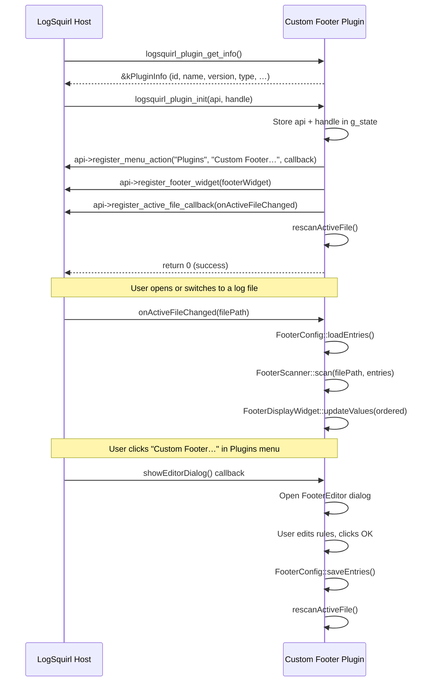

# Developer Guide — LogSquirl Custom Footer Plugin

This guide explains how the Custom Footer plugin works, how the
LogSquirl Plugin SDK is used, and how to extend or adapt the code.

## Plugin SDK Overview

The LogSquirl Plugin SDK is a **pure C ABI** interface.  A plugin is a
shared library (`.dylib` / `.so` / `.dll`) that exports four C functions:

| Symbol | Purpose |
|--------|---------|
| `logsquirl_plugin_get_info()` | Return static metadata (called before init) |
| `logsquirl_plugin_init()` | Receive host API, set up the plugin |
| `logsquirl_plugin_shutdown()` | Tear down, release all resources |
| `logsquirl_plugin_configure()` | Open a settings dialog (optional) |

The host provides a function-pointer table (`LogSquirlHostApi`) that the
plugin uses to interact with the application.

## Plugin Lifecycle

## Module Overview

| Module | File(s) | Responsibility |
|--------|---------|----------------|
| **Plugin entry** | `plugin.cpp`, `plugin.h` | C ABI exports, global state, lifecycle |
| **FooterEntry** | `footerentry.h` | Data model: key, linePattern, valuePattern, mappings |
| **FooterScanner** | `footerscanner.h/.cpp` | Stateless line-by-line scanning with two-stage matching |
| **FooterConfig** | `footerconfig.h/.cpp` | INI persistence + JSON import/export |
| **FooterEditor** | `footereditor.h/.cpp` | Rule editor dialog with inline mapping panel |
| **FooterDisplayWidget** | `footerdisplaywidget.h/.cpp` | Footer bar widget showing key-value pairs |

## Scanning Algorithm

1. Build compiled `QRegularExpression` objects for each enabled rule.
2. Read the log file line by line (up to `maxLines`).
3. For each line, check every unmatched rule:
   - **Stage 1 — Line Pattern**: If `linePattern` matches the line, proceed.
   - **Stage 2 — Value Pattern** (optional): If `valuePattern` is set, apply
     it to the same line and extract capture group 1.  If not set, extract
     capture group 1 from the line pattern match.
   - **Value Mapping**: If mappings are defined for the rule, substitute the
     raw value with the matching display value (exact string comparison).
4. Early termination when all rules have matched.

## Configuration Storage

Rules are stored in `custom_footer.ini` (QSettings INI format) inside the
plugin's config directory provided by the host.

The JSON import/export uses a versioned format (`version: 1`) to allow
forward-compatible changes.  See the README for format examples.

## Adding a New Feature

1. Extend `FooterEntry` in `footerentry.h` if new per-rule data is needed.
2. Update `FooterScanner::scan()` to use the new data.
3. Update `FooterConfig` to persist/load the new field (both INI and JSON).
4. Update `FooterEditor` to expose the field in the UI.
5. Add test scenarios in `tests/`.
