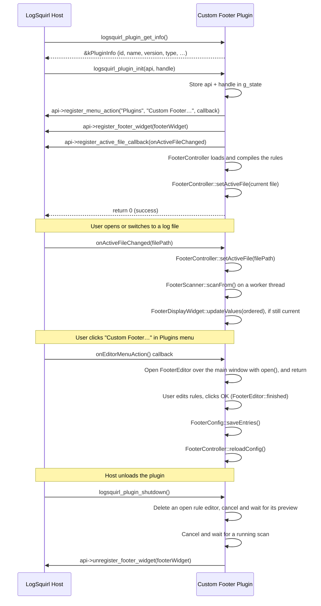

# Developer Guide — LogSquirl Custom Footer Plugin

This guide explains how the Custom Footer plugin works, how the
LogSquirl Plugin SDK is used, and how to extend or adapt the code.

## Plugin SDK Overview

The LogSquirl Plugin SDK is a **pure C ABI** interface.  A plugin is a
shared library (`.dylib` / `.so` / `.dll`) that exports four C functions:

| Symbol | Purpose |
|--------|---------|
| `logsquirl_plugin_get_info()` | Return static metadata (called before init) |
| `logsquirl_plugin_init()` | Receive host API, set up the plugin |
| `logsquirl_plugin_shutdown()` | Tear down, release all resources |
| `logsquirl_plugin_configure()` | Open a settings dialog (optional) |

The host provides a function-pointer table (`LogSquirlHostApi`) that the
plugin uses to interact with the application.

## Plugin Lifecycle

```mermaid
sequenceDiagram
    participant Host as LogSquirl Host
    participant Plugin as Custom Footer Plugin

    Host->>Plugin: logsquirl_plugin_get_info()
    Plugin-->>Host: &kPluginInfo (id, name, version, type, …)

    Host->>Plugin: logsquirl_plugin_init(api, handle)
    Plugin->>Plugin: Store api + handle in g_state
    Plugin->>Host: api->register_menu_action("Plugins", "Custom Footer…", callback)
    Plugin->>Host: api->register_footer_widget(footerWidget)
    Plugin->>Host: api->register_active_file_callback(onActiveFileChanged)
    Plugin->>Plugin: FooterController loads and compiles the rules
    Plugin->>Plugin: FooterController::setActiveFile(current file)
    Plugin-->>Host: return 0 (success)

    Note over Host,Plugin: User opens or switches to a log file

    Host->>Plugin: onActiveFileChanged(filePath)
    Plugin->>Plugin: FooterController::setActiveFile(filePath)
    Plugin->>Plugin: FooterScanner::scanFrom() on a worker thread
    Plugin->>Plugin: FooterDisplayWidget::updateValues(ordered), if still current

    Note over Host,Plugin: User clicks "Custom Footer…" in Plugins menu

    Host->>Plugin: onEditorMenuAction() callback
    Plugin->>Plugin: Open FooterEditor over the main window with open(), and return
    Plugin->>Plugin: User edits rules, clicks OK (FooterEditor::finished)
    Plugin->>Plugin: FooterConfig::saveEntries()
    Plugin->>Plugin: FooterController::reloadConfig()

    Note over Host,Plugin: Host unloads the plugin

    Host->>Plugin: logsquirl_plugin_shutdown()
    Plugin->>Plugin: Delete an open rule editor, cancel and wait for its preview
    Plugin->>Plugin: Cancel and wait for a running scan
    Plugin->>Host: api->unregister_footer_widget(footerWidget)
```

## Threading

Scans run on a single worker thread owned by `FooterController`. Every
started scan increments a generation counter; a finished scan is shown only
if no newer one was started, so switching files quickly never shows stale
values. Another active file, or reloaded rules, cancel the running scan. A
change of the active file does not: the running scan finishes, and one
follow-up scan then covers every change made meanwhile, however many there
were. Otherwise a log that changes more often than it can be scanned would
never show values. The result reaches the widget through a `QFutureWatcher`
on the GUI thread. `logsquirl_plugin_shutdown()` deletes the controller first, which
cancels the running scan and waits for the worker: after it returns, no code
of the plugin runs, and the host may unload the library.

Both workers are a `LatestJob` (`latestjob.h`): one worker thread, a
generation counter, a cancel flag, and results handed to the GUI thread
only for the latest job; `stop()` cancels, waits, and drops results not
yet handed over. Both watch the active file with an `ActiveFileWatcher`,
which collects changes for a pause, ignores queued changes of a file no
longer active, and watches the file's directory while it is missing.

The rule editor's live preview has a worker thread of its own, owned by
`RulePreviewer`, with the same rules: every request (an edit, another
selected rule, another active file) bumps its generation counter and
cancels the running preview, and a result is emitted only for the latest
request. An edit starts a preview after `RulePreviewer::kDelayMs` (300 ms)
without another one; another rule or active file starts one with the next
pass of the event loop (`Start::Soon`), coalesced with the change that
follows, so removing the selected rule previews once, on the remaining
rules. The active file is watched like the footer's: a change on disk
previews it again after `kRescanDelayMs`, and a rotated file once it is
recreated. A running preview of the file is not cancelled for a change
but followed by one more. A preview for a change starts no sooner than
`kRescanDelayMs` after the last one finished (`RulePreviewer::setClock()`
lets tests set the time), so a busy log is never scanned back to back,
and not at all when the change cannot alter it: lines appended beyond
the limit the last preview stopped at, or a file left as it was
(`FooterScanner::fileUnchangedFor()`, with the footer's identity checks). The
preview always scans the file from its start, unlike the footer, which
continues where it stopped. Setting the same active file again counts as
a change.

The editor never runs in a nested event loop: `exec()` would keep plugin
frames on the stack, and the host may shut the plugin down, and unload
it, from within that loop. `openEditor()` in `plugin.cpp` creates it on
the heap, parented to the host's window, opens it with `open()`, and
handles OK and Apply through `finished()` and `applied()`; a closed
editor is deleted later. The host always passes its main window, even while its
application-modal Plugins dialog is open; the editor then goes over the
application-modal window that blocks its own (`placeEditor()`), and back
over its own window, content and all, when that one is hidden or
deleted (`ModalGuest`). Its Import and Export file dialogs, error messages and the
rule template dialog are opened with `open()` too, parented to the editor, never with the static
`QFileDialog` and `QMessageBox` functions, which run nested loops. The
one nested loop left is a drag in the rule list (`QDrag::exec()`); a
shutdown during a drag cannot be triggered from the UI. `PluginState::editor` is a `QPointer` to it
until it is deleted, and `logsquirl_plugin_shutdown()` deletes it at
once: its destructor stops the preview (`RulePreviewer::stop()` cancels,
waits for the worker, stops its timers and deletes pending result
watchers), and deleting the objects drops their timers and posted
events. Closing the editor (`done()`) stops the preview for good; an edit
committed while it closes, such as an open mapping cell losing the
focus, starts none (`FooterEditor::closing_`). The destructor commits a
mapping cell being edited and disconnects the panel, model and list from
the editor before any child is deleted.

No exception may leave an entry point or host callback; they run their work
through `guarded()`, which logs the failure instead.

## Module Overview

| Module | File(s) | Responsibility |
|--------|---------|----------------|
| **Plugin entry** | `plugin.cpp`, `plugin.h` | C ABI exports, global state, lifecycle |
| **FooterEntry** | `footerentry.h` | Data model: key, linePattern, valuePattern, mappings |
| **FooterController** | `footercontroller.h/.cpp` | Cached rules, background scans, file watching |
| **FooterScanner** | `footerscanner.h/.cpp` | Compiles the rules once; line-by-line scanning with two-stage matching |
| **FooterConfig** | `footerconfig.h/.cpp` | INI persistence + JSON import/export |
| **FooterEditor** | `footereditor.h/.cpp` | Rule editor dialog: rule list, detail panel, validation |
| **RuleListModel** | `rulelistmodel.h/.cpp` | The editor's rules, one row each with its mappings and validation problems |
| **RuleListView** | `rulelistview.h/.cpp` | The rule list: drag & drop and Ctrl+Shift+Up/Down to reorder rules |
| **RuleDetailPanel** | `ruledetailpanel.h/.cpp` | Form for the selected rule: fields, mappings, problem marks |
| **ActiveFileWatcher** | `activefilewatcher.h/.cpp` | Watches the active file, or its directory while it is missing, with a pause after changes |
| **LatestJob** | `latestjob.h` | One worker thread whose latest job alone hands over its result |
| **RulePreviewer** | `rulepreviewer.h/.cpp` | Runs the live preview: debounced, on a worker thread, outdated results dropped |
| **RulePreviewView** | `rulepreviewview.h/.cpp` | The preview section of the detail panel: first match with highlights, values, count |
| **FooterValue** | `footervalue.h` | A shown value: key, displayed and raw value, and the rule that supplied it |
| **FooterDisplayWidget** | `footerdisplaywidget.h/.cpp` | Footer bar widget; one `FooterValueItem` per value, which copies it on a click |
| **SimpleRule** | `simplerule.h/.cpp` | Simple mode: generates a rule's patterns from the text before its value, and classifies patterns |
| **RuleTemplate** | `ruletemplate.h/.cpp`, `ruletemplatedialog.h/.cpp` | Ready-made rules for common values, and the dialog choosing one |

## Scanning Algorithm

1. Build compiled `QRegularExpression` objects for each enabled rule, once
   per set of rules. A rule without a line pattern is incomplete and
   ignored; one without a key, or with an invalid line or value pattern, is
   skipped and reported in `FooterScanner::problems()`.
2. Rules sharing a key are **alternatives**: the key's value comes from the
   first line that any of them matches; if several match that line, the
   rule higher in the list wins. The key is shown once, at the position of
   its first rule (`FooterScanner::footerValues()`).
3. Read the log file line by line, up to `maxLines` lines and at most
   64 MiB, even inside a single huge line. Lines longer than 64 KiB are
   matched against their first 64 KiB.
4. For each line, check every rule whose key has no value yet:
   - **Stage 1 — Line Pattern**: If `linePattern` matches the line, proceed.
   - **Stage 2 — Value Pattern** (optional): If `valuePattern` is set, apply
     it to the same line and extract capture group 1.  If not set, extract
     capture group 1 from the line pattern match. Without a capture group,
     the whole match is the value.
   - **Value Mapping**: If mappings are defined for the rule, substitute the
     raw value with the matching display value (exact string comparison).
5. Each found value is a `FooterValue`: key, shown value, raw value and the
   index of the rule that supplied it. `FooterScanner::footerValues()`
   hands them to the widget in rule order, for display and tooltips.
6. Stop early once every key has a value.
7. **Incremental rescans**: `scanFrom()` returns the scan's progress (offset
   and count of the complete lines scanned, the values found, and bytes
   identifying the file). When the watched file changes, the next scan
   continues from there if the file only grew, and reads nothing once every
   key has a value or a limit was reached. A file that shrank, whose start
   or scanned end differs, or with another birth time, is scanned from its
   start. A last line without a line break is matched but not remembered,
   as it may still be being written.

## Rule Editor

`FooterEditor` shows the rules in a list on the left and the selected rule
in a detail panel on the right.

- **`RuleListModel`** holds the rules. Each row is a whole `FooterEntry`,
  mappings included, plus its `RuleProblems`, so a rule's data and
  validation marks stay together whichever way rows are inserted, removed
  or moved (`moveRows()`). The list shows
  the enabled state as the check box of the key column, the key, and the
  line pattern elided to one line; everything else is edited in the panel.
- **`RuleDetailPanel`** edits a copy of the selected rule and emits
  `edited()` on every change; the editor stores `entry()` into the selected
  row, which updates the list at once. `showEntry()` never emits `edited()`,
  so showing a rule cannot change it. Return in a field only confirms it
  and Escape reverts it, instead of closing the dialog. Actions that do not
  take the focus (the tool buttons, OK and Apply) first call
  `commitPendingEdit()`, so a mapping cell still being typed is kept. The
  fields take patterns of any length. The panel is a column of sections
  (fields, mappings), so a live preview can be added as a further section.
- **Reordering**: ↑/↓, Ctrl+Shift+Up/Down in the list (`RuleListView`
  emits `moveUpRequested()` / `moveDownRequested()`; the keypad modifier,
  which macOS sets on every arrow key, is ignored) and drag & drop all
  move whole rows. A drag carries the dragged row numbers and a random
  token of the model they come from (`mimeData()`), so no other list takes
  them. `dropMimeData()` accepts only `Qt::MoveAction` and a row between
  rules (none means the end), and moves the rows with `moveRows()`, so a
  rule's mappings, enabled state and problems move with it, and the
  current index, and so the panel, follows it. `RuleListView::startDrag()`
  replaces `QAbstractItemView`'s, which would remove the selected rows
  after a drag ending in a move, and those are then the moved rule itself.
  Before a drop moves anything, the model emits `aboutToDropRules()`, on
  which the editor commits the panel's pending edit. Tests
  (`tests/ruledragdrop_test.cpp`) simulate drags with `mimeData()` and
  `dropMimeData()`, and send drag and drop events to the view's viewport.
  Offscreen, `QDrag::exec()` returns at once, so those events have no
  source and the `InternalMove` view ignores them; the tests switch the
  view to `DragDrop` to get past that check to the same drop handling.
- **Validation** checks one rule: an invalid pattern, or an enabled rule
  with a line pattern but no key, becomes a problem of that field. An edit
  validates only the edited rule, and new rules are validated when they are
  added; removing or moving rules validates nothing and only renumbers the
  problems. Problems are marked at the field with the reason, on the rule's
  row in the list (`problemColor()`), and below the list with the rule
  number; OK and Apply stay disabled while there are any. Each pattern is
  compiled once per dialog and its error cached
  (`FooterEditor::patternCompilations()`, `ruleValidations()`).
- **Live preview**: the panel's last section, a `RulePreviewView`, shows
  `FooterScanner::preview()` of the selected rule against the active file,
  which the plugin passes in with `FooterEditor::setActiveFile()` when the
  editor opens and whenever the host switches files, along with the
  footer's line limit (`setMaxLines()`). `preview()` uses the scanner's
  own compiling, matching (`valueOf()`) and line reading: `forEachLine()`
  reads, counts and limits lines for `scanFrom()` and `preview()` alike,
  so the preview cannot disagree with the footer. Only the first match
  is matched again with `matchOf()`, for its offsets, which the footer's
  scan never computes; a rule that is also one of its key's rules is
  matched once per line. It
  reads on after the first match to the limits, to count the matching
  lines, and reports the first match's line number (from 1), its line
  (at most 64 KiB) with the spans of the line pattern's match and of the
  value, which limit stopped the scan before the end of the file, and
  which enabled rule of the key supplies the key's value, and from which
  line. A disabled rule is previewed too, but never supplies the key.
  Without an active file, an invalid pattern or no line pattern, it
  returns a status that the view explains; without a file this is
  decided on the GUI thread, as nothing is read. A rule without a line
  pattern because of a problem, such as an unfinished simple rule, shows
  that problem and is not scanned. Each change schedules one preview
  (`FooterEditor::schedulePreview()`): an edit where it is stored, a
  rule enabled in the list, and rows inserted, removed or moved; not
  every `dataChanged()`, which validation marks emit too. The long line
  around the first match is cut between whole characters, never inside a
  surrogate pair. Tests set the pauses to 0 (`setDelays()`) or start
  a preview with `flush()`, so they wait for no real time, and replace
  the preview function (`setPreviewFunction()`) to hold a preview on the
  worker (`tests/rulepreview_test.cpp`).

### Simple mode

`simplerule.h` holds free functions, independent of the editor, so rule
templates can build simple rules too:

- **`simpleLinePattern(SimpleRule)`** generates the line pattern:
  the text before the value, `\s*`, and the value as capture group 1 —
  `(\S+)` up to whitespace, `(.*\S)` up to the end of the line, or
  `([^c]*[^c\s])` up to the character `c`, so the value never starts or
  ends with whitespace. Escaping is minimal, so generated patterns read like
  hand-written ones: the text escapes only `\ ^ $ . | ? * + ( ) [ {`
  (`]` and `}` are literal outside a class once `[` and `{` are escaped,
  and patterns never use extended mode, so spaces and `#` stay literal),
  and writes NUL as `\x{0}`; `c` escapes only `\ ] ^ -`. `c` is one code
  point, kept in a `QString` because it may be a surrogate pair; the field
  takes one code point, not one UTF-16 unit. A simple rule has no value
  pattern, so the scanner's single-stage path applies. `\s` and `\S` are
  ASCII-only, as the scanner compiles without
  `UseUnicodePropertiesOption`; changing that would change every
  hand-written rule, so a no-break space is part of a value, and a test
  pins it. `applySimpleRule()` sets both patterns of a `FooterEntry`.
- **`endCharacterProblem()`** says why the end character cannot be used:
  none, more than one code point, or a control character such as NUL or a
  tab. Then, as without a text, the pattern is empty.
- **`simpleRuleOf()`** classifies: it parses the text and the end back out
  of the line pattern, generates the patterns again, and accepts the rule
  only if they are the stored ones byte for byte. Empty patterns are the
  empty simple rule. Everything else is advanced, so nothing is ever
  rewritten into another form.

`RuleDetailPanel` shows a rule in simple mode exactly when `simpleRuleOf()`
accepts it, or when it is an unfinished simple rule; the mode is not
stored anywhere. A simple rule with an `endCharacterProblem()` has no
patterns to keep its fields in: its `entry()` has empty patterns, and the
panel hands the fields to the editor as `unfinishedSimpleRule()`. That is
editor state, not part of the domain type `FooterEntry`: `RuleListModel`
keeps it per row, next to the rule's problems, so it moves with the rule
(also by drag & drop) and never reaches `entries()`, a save or an export.
The editor turns it into a problem at the end character field that blocks
OK and Apply, and passes it to `showEntry()` again, so switching rules loses
nothing. In simple mode the simple
fields regenerate the patterns on every edit and the pattern fields are
read-only; `entry()` always reads the pattern fields. **Advanced** makes them
editable and keeps their text. Switching back is enabled only while
`simpleRuleOf()` accepts the current patterns, and keeps the simple fields
if they still generate those patterns. Escape never reverts a read-only
pattern field, and a pattern field that becomes editable reverts to the
pattern it became editable with. The value-end list and the Advanced switch
handle Return and Escape like the line edits: Return confirms, Escape goes
back to the state at focus or at the last Return, and neither closes the
dialog. Enabling or disabling the rule in
the list updates only the panel's check box (`showEnabled()`), so the mode
chosen for the selected rule is kept. Tests: `tests/simplerule_test.cpp`,
`tests/simplemode_test.cpp`, and the simple rules in
`tests/configroundtrip_test.cpp`.

The editor never changes rules it only shows: a config saved by 0.3.0 is
saved back byte for byte (`tests/configroundtrip_test.cpp`).

### Rule templates

`ruletemplate.h` is a data table, `ruleTemplates()`: each `RuleTemplate`
has a name, a one-line description, a key, and either a `SimpleRule` or an
advanced `linePattern` with the value as group 1. `entry()` builds the
rule: a simple template goes through `applySimpleRule()`, so its patterns
are exactly what simple mode generates and it opens in simple mode; an
advanced one keeps its pattern and opens in advanced mode. A template
with an empty key asks for it (`asksForKey()`): `%1` in its pattern is the
`givenKey()` (trimmed, one trailing `=` dropped) escaped with
`QRegularExpression::escape()`, and without a key `entry()` is empty. Only
values with a shape or boundaries a simple rule cannot express are
advanced: Version, IPv4, ISO 8601 timestamps, and `key=value`, whose key
must not end a longer key (`(?<![\w.-])`, before up to two dashes so
flags like `--user=` match but `my-user=` does not) and whose value starts
right after `=`. The patterns guard their edges with lookarounds rather than
anchors or `\b`, as a value may be anywhere in the line and `_` counts as
a word character; `\d` and `\w` are ASCII, like everything the scanner
compiles. Version takes `version` after `_` or as a camel-case `Version`,
but not after another letter, trading a missed `appversion` for no match
in `conversion` or `server`, and skips an XML declaration's version
(`(?<!<\?xml\s)`); its SemVer suffix needs a letter in its first
identifier, and a number shaped like `\d{4}-\d{2}` is not a version, so
dates are never taken. The timestamp's seconds, fraction and offset are an
atomic group followed by `(?!\d|:\d)`, so a truncated field (`10:30:5`,
`+01:0`) fails instead of backtracking to a shorter match, while a `:`
after a complete timestamp, as in `10:30:00: started`, is fine. Each template is tested
with lines it must find and lines it must not, through `FooterScanner`
(`tests/ruletemplate_test.cpp`). A new template is a row in
`makeTemplates()` plus such samples.

`RuleTemplateDialog` lists name and description in a `QTreeWidget`, with a
key field enabled only for a template that asks for one; OK is enabled
once `entry()` has a key, and a hint says a typed trailing `=` is dropped.
It gets the keys of enabled rules with a line pattern, the ones the scanner
uses, in `reset()` and shows a note when the new rule's key is one of
them: the rule is still added, as an alternative. `FooterEditor::addFromTemplate()` commits the panel's
pending edit, keeps one dialog, calls `reset()` and `open()` (not `exec()`,
so tests click through it), and on `accepted` appends `entry()` and selects
it, like the add button, without touching other rows.

## Configuration Storage

Rules are stored in `custom_footer.ini` (QSettings INI format) inside the
plugin's config directory provided by the host.

The JSON import/export uses a versioned format (`version: 1`) to allow
forward-compatible changes.  See the README for format examples.

## Adding a New Feature

1. Extend `FooterEntry` in `footerentry.h` if new per-rule data is needed.
2. Update `FooterScanner` (compiling and `scanFrom()`) to use the new data.
3. Update `FooterConfig` to persist/load the new field (both INI and JSON).
4. Update `FooterEditor` to expose the field in the UI.
5. Add test scenarios in `tests/`.
